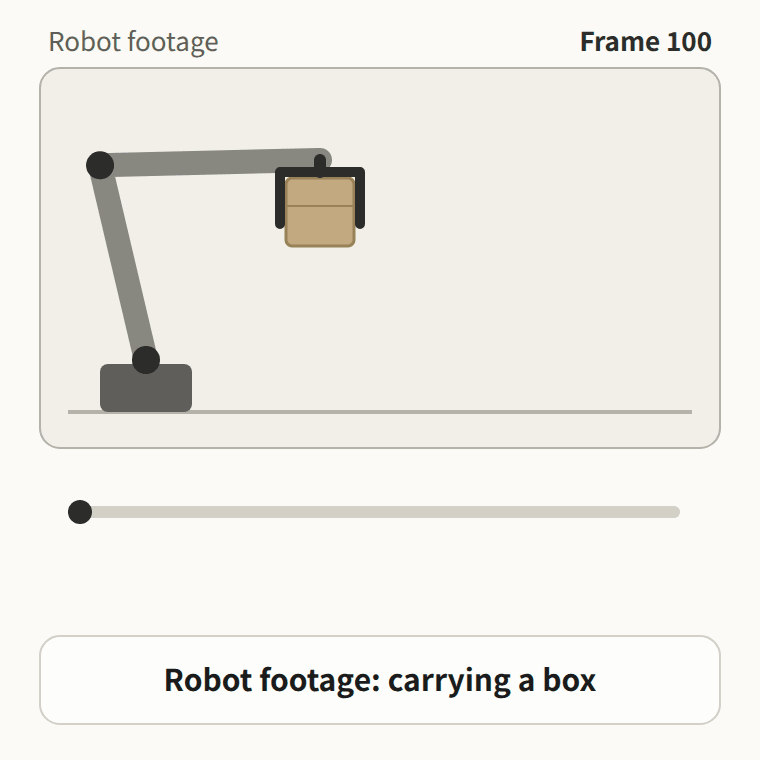

# robot-failure-schema-tools

**Score the gap between synthetic and real robot failures.**

Two small Python scripts for robot manipulation failure–recovery data:

- `gen5_validate.py` compares a **synthetic** failure set with a **real** one on four axes (failure type, failure length, recovery rate, recovery latency) and lists the real failure types that never appear in the synthetic set.
- `to_schema_v1.py` converts any episode table (CSV, Parquet or JSON) into one common schema so the two sets can be compared. Fields your data does not have stay `null`; nothing is guessed.



## Why

Do your synthetic failures look like the failures your robot actually hits after deployment? These tools make that check repeatable: put both sets in the same schema, then measure the distance.

## Try it in one minute

```bash
python to_schema_v1.py example_real.csv --map example_map_vifailback.json --source REAL -o real.json
python to_schema_v1.py example_synthetic.csv --map example_map_vifailback.json --source SYN -o syn.json
python gen5_validate.py syn.json real.json
```

The report gives a Jensen–Shannon divergence per axis (0 = identical, 1 = completely different) and the real failure types missing from the synthetic set. In this example, `collision` never appears in the synthetic set.

Only the Python standard library is needed. Parquet input also needs `pip install pandas pyarrow` (use pyarrow 14.0.1 or newer when reading files from untrusted sources).

## Use it on your own data

1. Write a mapping `{schema_field: your_column}`. See `example_map_droid.json` (DROID metadata: only `segment_id` and `success`) and `example_map_vifailback.json` (ViFailback / LeRobot-style table with failure and recovery frames).
2. Convert your real set and your synthetic set with the same mapping.
3. Compare them: `python gen5_validate.py synthetic.json real.json -o report.md`

Recognised mapping keys: `segment_id`, `failure_frame_start`, `failure_frame_end`, `recovery_frame`, `success`, `error_code`.

## Output fields (schema v1 summary)

One segment = one failure episode.

| field | meaning |
|---|---|
| `segment_id` | `{source}_{id}` |
| `source` | dataset name |
| `source_label` | original failure label, verbatim |
| `failure_frame` | `{start, end}` frames of the failure |
| `error_code` | filled only when the value is already an `EX.*` code |
| `recovery_frame` | first frame of the retry |
| `recovery` | 1 = the retry completed the task, 0 = it did not, `null` = unknown |
| `remediation`, `kinematic_signature`, `condition`, `intervention`, `causal_chain` | reserved, empty in v1 |

Each output file also carries a manifest with a SHA-256 hash of its segments.

## Failure and recovery frames came back blank?

Most robot logs only record success or failure. If your converted file has empty `failure_frame` and `recovery_frame`, those frames can be labeled from your robot footage. Free pilot on 10–50 of your clips: open an issue titled **Pilot request**.

## License

MIT for the code. Converted outputs keep the license of their source dataset.

Mimi Han · Mimi Multimodal AI
